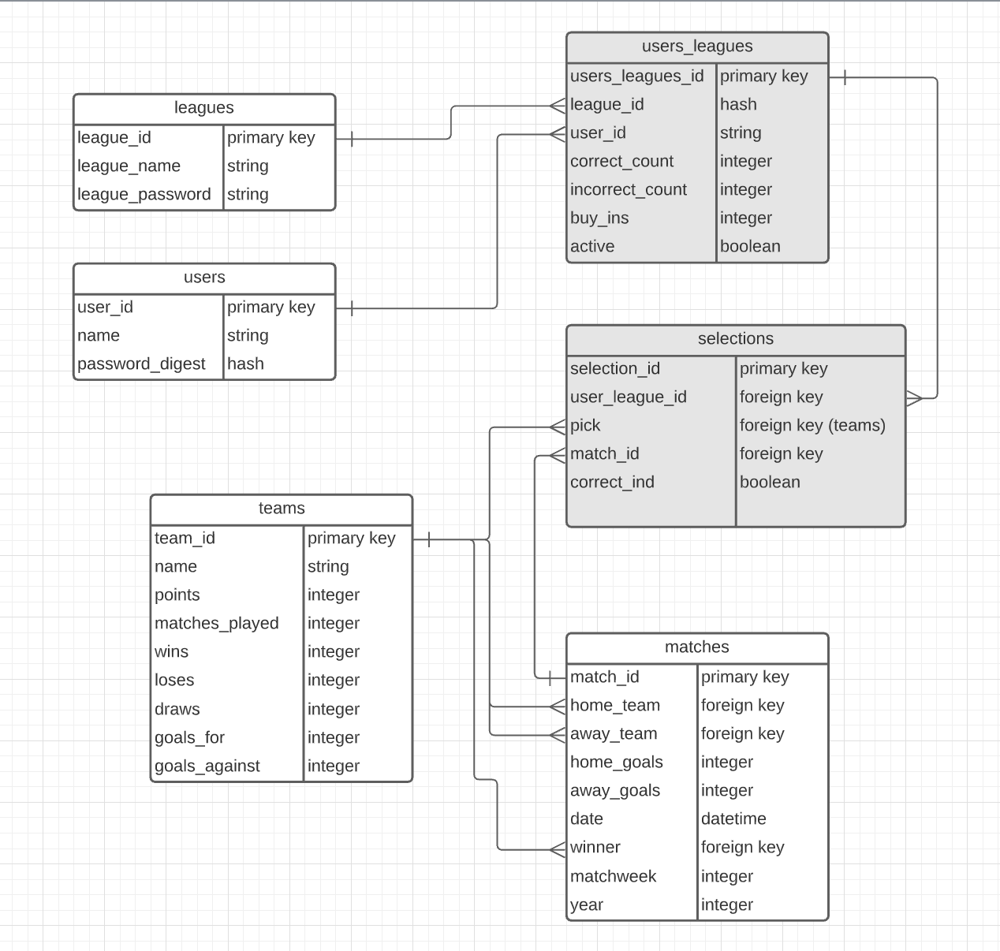

# premier-league-survivor

- [Overview](#overview)
- [MVP](#mvp)
  - [Goals](#goals)
  - [Libraries and Dependencies](#libraries-and-dependencies)
  - [Client (Front End)](#client-front-end)
    - [Wireframes](#wireframes)
    - [Component Tree](#component-tree)
    - [Component Hierarchy](#component-hierarchy)
    - [Component Breakdown](#component-breakdown)
    - [Time Estimates](#time-estimates)
  - [Server (Back End)](#server-back-end)
    - [ERD Model](#erd-model)
- [Post-MVP](#post-mvp)
- [Code Showcase](#code-showcase)
- [Code Issues & Resolutions](#code-issues--resolutions)

<br>

## Overview

_**Premier League Survivor** is a game centered around the English Premier League. The user can create an account. After creating an account, the user can create and join leagues. Each league will have a seperate leaderboard and is designed to be like a fantasy football laegue. The rules of the game are the following:_
1. _Select only 1 game each matchweek per league (there are 38)._
2. _You can only select one team 2 times throughout a single Premier League season._
3. _You can only select games that have not started._
4. _If a game that you have selected a winner from starts, you cannot change your pick._
5. _If you select a winner, you get 3 points. A tie is worth 1 point, and a loss is worth 0 points._


<br>

## MVP

_The **Premier League Survivor** MVP will allow users to create, join, and edit leagues. Within a league, users will compete with each other by selecting a winner each matchweek._

<br>

### Goals

- _Make gameplay possible_
- _Give a leaderboard for each league_
- _Make the game logic work with the schedule picker and the backend_
- _Allow users to close and open leagues that they created_

<br>

### Libraries and Dependencies

|     Library      | Description                                |
| :--------------: | :----------------------------------------- |
|      React       | __ |
|   React Router   | __ |
| React SemanticUI | __ |
|     Ruby      | __ |
|  Rails | __ |
|  Styled Components | __ |
|  Framer Motion | __ |

<br>

### Client (Front End)

#### Wireframes

- Desktop - login, signup, and home screens


- Desktop - all leagues, league detail, create league, and edit league screens


- Desktop - picks and schedules screens


- Tablet - changes 


- Mobile - changes 


#### Component Tree

Component Tree: https://whimsical.com/47YhdNh9RAvumqwcFegzaN

#### Component Hierarchy

``` structure

src
|__ assets/
      |__ style.css
|__ components/
      |__ shared/
          |__ Layout.jsx
          |__ Header.jsx
          |__ Footer.jsx
          |__ Nav.jsx
      |__ MainButton.jsx
      |__ SecondaryButton.jsx
      |__ UserLeagueList.jsx
      |__ LoginSinupForm.jsx
      |__ Leagues.jsx
      |__ LeagueRow.jsx
      |__ LeagueInfo.jsx
      |__ Leaderboard.jsx
      |__ LeaderboardRow.jsx
      |__ EditLeagueForm.jsx
      |__ CreateLeagueForm.jsx
      |__ MatchweekDropdown.jsx
      |__ MatchweekForm.jsx
      |__ Picks.jsx
      |__ PickRow.jsx
|__ content/
      |__ login.js
      |__ home.js
      |__ signUp.js
      |__ allLeagues.js
      |__ leagueDetail.js
      |__ editLeague.js
      |__ createLeague.js
      |__ matches.js
      |__ picks.js
|__ screens/
      |__ Login.js
      |__ Home.js
      |__ SignUp.js
      |__ AllLeagues.js
      |__ LeagueDetail.js
      |__ EditLeague.js
      |__ CreateLeague.js
      |__ Matches.js
      |__ Picks.js
|__ services/
      |__ auth.js
      |__ leagues.js
      |__ schedulePicks.js
```

#### Component Breakdown

> Use this section to go into further depth regarding your components, including breaking down the components as stateless or stateful, and considering the passing of data between those components.

|  Component   |    Type    | state | props | Description                                                      |
| :----------: | :--------: | :---: | :---: | :--------------------------------------------------------------- |
|    Layout    | functional |   n   |   n   | _contains the header, nav, and footer_               |
|    Header    | functional |   n   |   n   | _contains the nav bar_               |
|    Nav       | functional |   n   |   n   | _has links to help navigate throughout the site_               |
|    Footer    | functional |   n   |   n   | _will house info to my personal site, gitbut, etc_               |
| MainButton   | functional |   n   |   y   | _main button to be used throughout the site_               |
| SecondaryButton   | functional |   n   |   y   | _secondary button to be used throughout the site_               |
| UserLeagueList   | functional |   y   |   n   | _shows all the leagues a user has joined_               |
| LoginSignupForm   | functional |   y   |   y   | _form to be used for both login and signup_               |
| Leagues   | functional |   y   |   y   | _will contain the LeaguesRow - a list of all the open leagues that you can join _               |
| LeaguesRow   | functional |   y   |   y   | _will have info about a single league_               |
| LeagueInfo  | functional |   y   |   y   | _info container on league screen_               |
| Leaderboard  | functional |   y   |   y   | _have the leaderboard for a single league_               |
| LeaderboardRow  | functional |   y   |   y   | _will contain a single row for the leaderboard_               |
| EditLeagueForm  | functional |   y   |   y   | _Form to edit a league_               |
| MatchweekDropdown  | functional |   y   |   y   | _will contain a dropdown for users to select the matchweek they want to look at_               |
| MatchweekForm  | functional |   y   |   y   | _will contain the form to make a selection for that matchweek_               |
| Picks  | functional |   y   |   y   | _will contain the list of all the users picks_               |
| PickRow  | functional |   y   |   y   | _will contain the row for a single user pick_               |

#### Time Estimates

| Task                | Priority | Estimated Time | Time Invested | Actual Time |
| ------------------- | :------: | :------------: | :-----------: | :---------: |
| Setup Backend    |    H     |     5 hrs      |      hrs     |     hrs    |
| Auth    |    H     |     2 hrs      |      hrs     |     hrs    |
| League CRUD    |    H     |     4 hrs      |      hrs     |     hrs    |
| Matches/Pick Create & Read    |    H     |     4 hrs      |      hrs     |     hrs    |
| Layout    |    M     |     3 hrs      |      hrs     |     hrs    |
| Home Screen    |    M     |     2 hrs      |      hrs     |     hrs    |
| Leagues Styling    |    M     |     2 hrs      |      hrs     |     hrs    |
| League Detail Styling    |    L     |     3 hrs      |      hrs     |     hrs    |
| Edit League Styling    |    L     |     3 hrs      |      hrs     |     hrs    |
| Create League Styling    |    L     |     3 hrs      |      hrs     |     hrs    |
| Matches Styling    |    M     |     8 hrs      |      hrs     |     hrs    |
| Picks Styling    |    M     |     2 hrs      |      hrs     |     hrs    |
| TOTAL               |          |      hrs      |      hrs     |     TBD     |


<br>

### Server (Back End)

#### ERD Model



<br>

***

## Post-MVP

1. Add more details to the home page (like best score, upcoming picks)
2. Build a true survivor game. The rules change and you are lose the game when a selection loses or 3 selections tie.
3. Views to see what teams have been picked each week and what picks a single user has made.

***

## Code Showcase

> Use this section to include a brief code snippet of functionality that you are proud of and a brief description.

## Code Issues & Resolutions

> Use this section to list of all major issues encountered and their resolution.
