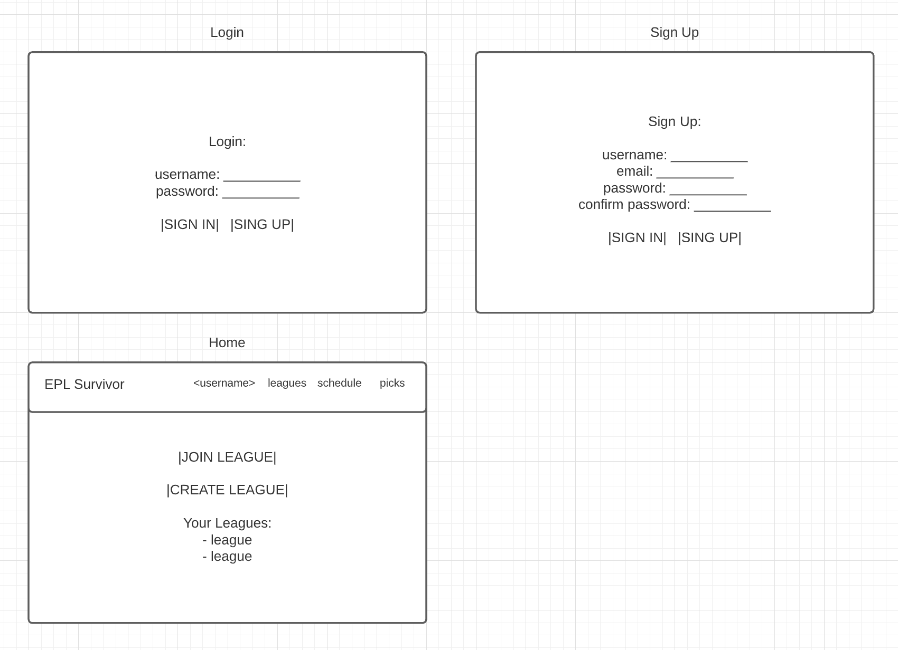
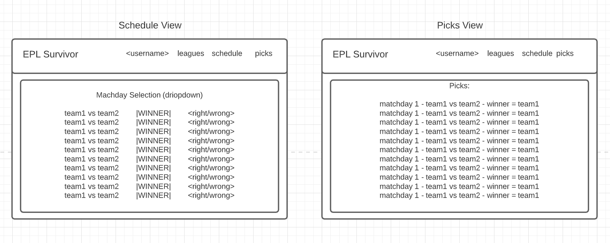

# premier-league-survivor

# premier-league-survivor README <!-- omit in toc -->

- [Overview](#overview)
- [MVP](#mvp)
  - [Goals](#goals)
  - [Libraries and Dependencies](#libraries-and-dependencies)
  - [Client (Front End)](#client-front-end)
    - [Wireframes](#wireframes)
    - [Component Tree](#component-tree)
    - [Component Hierarchy](#component-hierarchy)
    - [Component Breakdown](#component-breakdown)
    - [Time Estimates](#time-estimates)
  - [Server (Back End)](#server-back-end)
    - [ERD Model](#erd-model)
- [Post-MVP](#post-mvp)
- [Code Showcase](#code-showcase)
- [Code Issues & Resolutions](#code-issues--resolutions)

<br>

## Overview

_**Premier League Survivor** is a game centered around the English Premier League. The user can create an account. After creating an account, the user can create and join leagues. Each league will have a seperate leaderboard and is designed to be like a fantasy football laegue. The rules of the game are the following:_
1. _Select only 1 game each matchweek per league (there are 38)._
2. _You can only select one team 2 times throughout a single Premier League season._
3. _You can only select games that have not started._
4. _If a game that you have selected a winner from starts, you cannot change your pick._
5. _If you select a winner, you get 3 points. A tie is worth 1 point, and a loss is worth 0 points._


<br>

## MVP

_The **Premier League Survivor** MVP will allow users to create, join, and edit leagues. Within a league, users will compete with each other by selecting a winner each matchweek._

<br>

### Goals

- _Make gameplay possible_
- _Give a leaderboard for each league_
- _Make the game logic work with the schedule picker and the backend_
- _Allow users to close and open leagues that they created_

<br>

### Libraries and Dependencies

|     Library      | Description                                |
| :--------------: | :----------------------------------------- |
|      React       | __ |
|   React Router   | __ |
| React SemanticUI | __ |
|     Express      | __ |
|  Express Router  | __ |

<br>

### Client (Front End)

#### Wireframes

- Desktop - login, signup, and home screens


- Desktop - all leagues, league detail, create league, and edit league screens


- Desktop - picks and schedules screens




#### Component Tree

Component Tree: https://whimsical.com/47YhdNh9RAvumqwcFegzaN

#### Component Hierarchy

``` structure

src
|__ assets/
      |__ style.css
|__ components/
      |__ shared/
          |__ Layout.jsx
          |__ Header.jsx
          |__ Footer.jsx
          |__ Nav.jsx
      |__ MainButton.jsx
      |__ SecondaryButton.jsx
      |__ UserLeagueList.jsx
      |__ LoginSinupForm.jsx
      |__ Leagues.jsx
      |__ LeagueRow.jsx
      |__ LeagueInfo.jsx
      |__ Leaderboard.jsx
      |__ LeaderboardRow.jsx
      |__ EditLeagueForm.jsx
      |__ CreateLeagueForm.jsx
      |__ MatchweekDropdown.jsx
      |__ MatchweekForm.jsx
      |__ Picks.jsx
      |__ PickRow.jsx
|__ content/
      |__ login.js
      |__ home.js
      |__ signUp.js
      |__ allLeagues.js
      |__ leagueDetail.js
      |__ editLeague.js
      |__ createLeague.js
      |__ schedule.js
      |__ picks.js
|__ screens/
      |__ Login.js
      |__ Home.js
      |__ SignUp.js
      |__ AllLeagues.js
      |__ LeagueDetail.js
      |__ EditLeague.js
      |__ CreateLeague.js
      |__ Schedule.js
      |__ Picks.js
|__ services/
      |__ auth.js
      |__ leagues.js
      |__ schedulePicks.js
```

#### Component Breakdown

> Use this section to go into further depth regarding your components, including breaking down the components as stateless or stateful, and considering the passing of data between those components.

|  Component   |    Type    | state | props | Description                                                      |
| :----------: | :--------: | :---: | :---: | :--------------------------------------------------------------- |
|    Layout    | functional |   n   |   n   | _contains the header, nav, and footer_               |
|    Header    | functional |   n   |   n   | _contains the nav bar_               |
|    Nav       | functional |   n   |   n   | _has links to help navigate throughout the site_               |
|    Footer    | functional |   n   |   n   | _will house info to my personal site, gitbut, etc_               |
| MainButton   | functional |   n   |   n   | _main button to be used throughout the site_               |
| SecondaryButton   | functional |   n   |   n   | _secondary button to be used throughout the site_               |

#### Time Estimates

> Use this section to estimate the time necessary to build out each of the components you've described above.

| Task                | Priority | Estimated Time | Time Invested | Actual Time |
| ------------------- | :------: | :------------: | :-----------: | :---------: |
| Add Contact Form    |    L     |     3 hrs      |     2 hrs     |    3 hrs    |
| Create CRUD Actions |    H     |     3 hrs      |     1 hrs     |     TBD     |
| TOTAL               |          |     6 hrs      |     3 hrs     |     TBD     |

> _Why is this necessary? Time frames are key to the development cycle. You have limited time to code your app, and your estimates can then be used to evaluate possibilities of your MVP and post-MVP based on time needed. It's best you assume an additional hour for each component, as well as a few hours added to the total time, to play it safe._

<br>

### Server (Back End)

#### ERD Model

> Use this section to display an image of a computer generated ERD model. You can use draw.io, Lucidchart or another ERD tool.

<br>

***

## Post-MVP

> Use this section to document ideas you've had that would be fun (or necessary) for your Post-MVP. This will be helpful when you return to your project after graduation!

***

## Code Showcase

> Use this section to include a brief code snippet of functionality that you are proud of and a brief description.

## Code Issues & Resolutions

> Use this section to list of all major issues encountered and their resolution.
